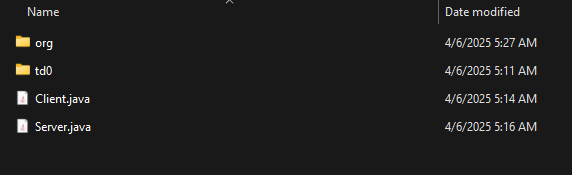
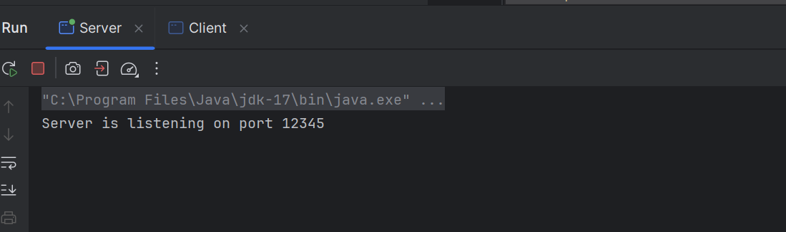
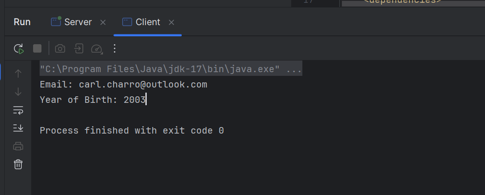
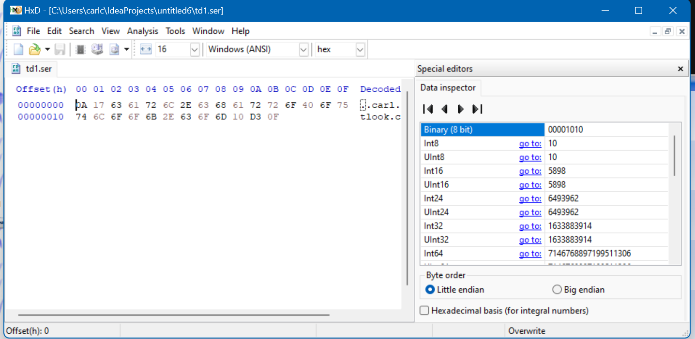

## gRPC Homework using ProfoBuff

#### Platform & Software Versions:
  - Windows
  - protoc 25.2
  - Intellij Idea Ultimate 2024.3.3

#### Step 1: Create .proto file and add code.

##### Code:
```proto
syntax="proto3";
package td0;
option java_multiple_files = true;
message MyUser {
    string email=1;
    uint32 year_of_birth=2;
}
```

#### Step 2: Compile code using protoc command
```
protoc -I . --java_out . Ex0.proto
```
##### This will generate the package folder with the java classes (MyUser, MyUserOrBuilder, Ex0)



#### Step 3: Adding the Server Code
```java
import java.io.FileOutputStream;
import java.io.IOException;
import java.io.OutputStream;
import java.net.ServerSocket;
import java.net.Socket;
import td0.MyUser;

public class Server {
    public static void main(String[] args) {
        try (ServerSocket serverSocket = new ServerSocket(12345)) {
            System.out.println("Server is listening on port 12345");
            while (true) {
                try (Socket socket = serverSocket.accept()) {
                    MyUser user = MyUser.newBuilder()
                            .setEmail("carl.charro@outlook.com")
                            .setYearOfBirth(2003)
                            .build();
                    OutputStream outputStream = socket.getOutputStream();
                    user.writeTo(outputStream);
                    outputStream.flush();
                    user.writeTo(new FileOutputStream("td1.ser"));
                } catch (IOException e) {
                    e.printStackTrace();
                }
            }
        } catch (IOException e) {
            e.printStackTrace();
        }
    }
}
```

#### Step 4: Adding the Client code
```java
import com.google.protobuf.InvalidProtocolBufferException;
import td0.MyUser;
import java.io.IOException;
import java.io.InputStream;
import java.net.Socket;
public class Client {
    public static void main(String[] args) {
        try (Socket socket = new Socket("localhost", 12345)) {
            InputStream inputStream = socket.getInputStream();
            MyUser user = MyUser.parseFrom(inputStream);
            System.out.println("Email: " + user.getEmail());
            System.out.println("Year of Birth: " + user.getYearOfBirth());
        } catch (IOException e) {
            e.printStackTrace();
        }
    }
}

```

#### Step 5: Run Server then Client




#### Step 6: Examining the .ser file using hexdump


